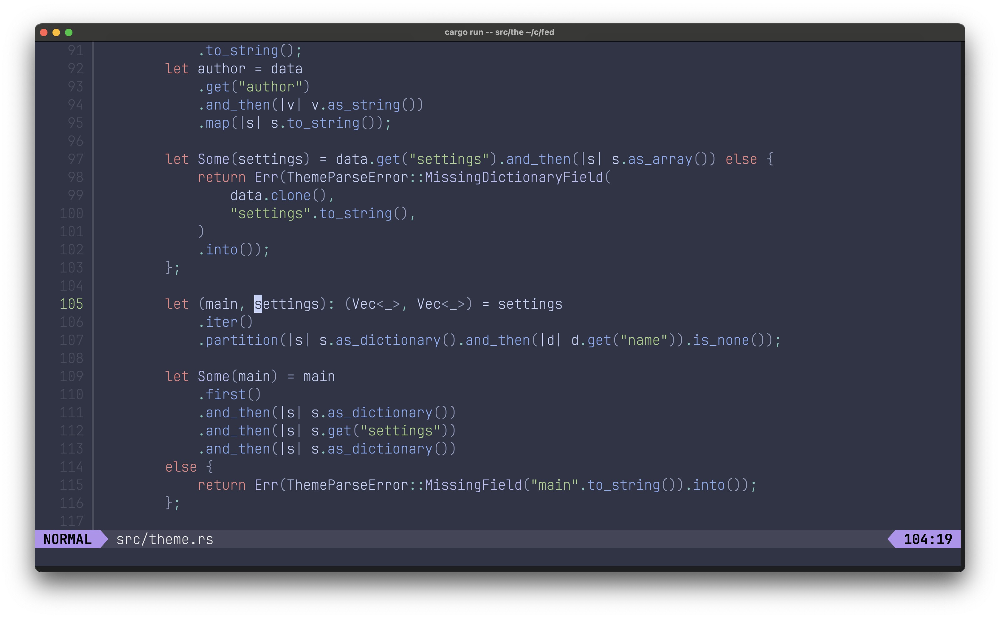

# Fed - A Toy Editor Inspired by Neovim

## Introduction

**Fed** is a toy text editor written in Rust, inspired by the powerful and extensible Neovim. It aims to provide a simplified yet efficient editing experience, drawing on the best aspects of Neovim's interface and capabilities.



## Roadmap

- ✅ Normal mode
  - ✅ Basic movements (h, j, k, l)
  - 🚧 Word movements (w, b)
  - 🚧 Page movements (C-f, C-b)
  - ✅ Line insertions (o, O)
  - ⏳ Replacements (c, r)
  - 🚧 Deletions (x, d)
    - ✅ Unary x deletion
    - ⏳ Combo x deletion (10x)
    - ✅ Line deletion (dd)
    - ⏳ Combo line deletion (d10d)
    - ⏳ Combo line deletion (dw, etc.)
  - ⏳ Undo and redo
- ✅ Insert mode
- 🚧 Command mode
  - ✅ `quit` command
  - ✅ `0` and `$`
- ⏳ Visual mode
- 🚧 Mouse support
- 🚧 Status line
- 🚧 Syntax highlighting
  - ✅ Javascript
  - ✅ Rust
- 🚧 Theming
  - 🚧 TextMate (tmTheme) themes
  - 🚧 Visual Studio themes

⏳ = Not Started
🚧 = Started
✅ = Done

## Features

- **Modal Editing**: Like Neovim, Fed supports modal editing, separating text entry from command execution.
- **Syntax Highlighting**: Basic syntax highlighting for a variety of programming languages.
- **Extensibility**: While simpler than Neovim, Fed can be extended with plugins written in Rust.
- **Cross-Platform Support**: Compatible with multiple operating systems, thanks to Rust's cross-platform capabilities.

## Getting Started

### Prerequisites

- Rust Programming Language: Ensure you have Rust installed on your system. [Install Rust](https://www.rust-lang.org/tools/install).
- Terminal: Fed is a terminal-based editor, so a command-line interface is required.

### Installation

1. Clone the repository:
   ```bash
   git clone https://github.com/yourusername/fed.git
   ```
2. Navigate to the project directory:
   ```bash
   cd fed
   ```
3. Build the project using Cargo:
   ```bash
   cargo build --release
   ```
4. Run the editor:
   ```bash
   ./target/release/fed
   ```

## Usage

- **Modes**: Switch between different modes (insert, command, etc.) as in Neovim.
- **Opening Files**: To open a file, use `:open <filename>` in command mode.
- **Saving Files**: Save your changes with `:w` or `:wq` to write and quit.

## Contributing

Contributions are welcome! If you'd like to contribute to Fed, please read `CONTRIBUTING.md` for more information on how to submit pull requests, coding standards, and more.

## License

This project is licensed under the MIT License - see the `LICENSE` file for details.
